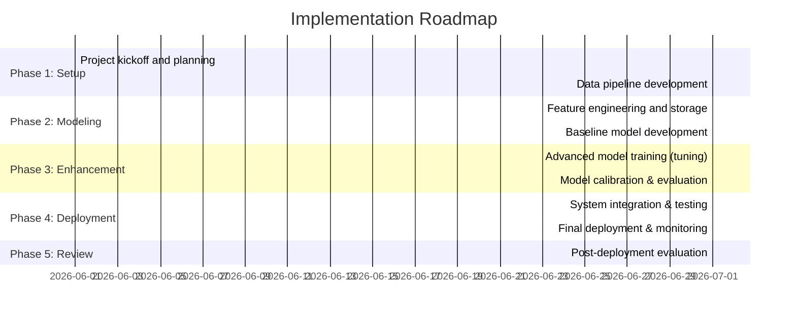

# Tennis Match Prediction Strategy: Validation and Specification

**Executive Summary:** We analyze the existing Tennis Match Predictive Engine strategy and propose a rigorous, improved specification. The original system uses historical ATP match data (1968–2025), features like Elo ratings and recent form, and an XGBoost model, achieving ~66% accuracy on Wimbledon 2025 (vs. 63.8% for IBM’s model and 72.0% for betting odds). Key assumptions include reliance on publicly available match stats and pre-match features; strengths include robust temporal isolation (no leakage) and use of well-known metrics (Elo). Weaknesses/gaps include missing data on qualifiers, lack of betting-odds features, limited real-time updates, and metrics focused only on accuracy. Risks include overfitting, data licensing, and regulatory issues in sports betting.  

**Improvements:** We recommend expanding data sources and features (e.g. head-to-head history, player bio/stats, public betting odds), using advanced models and ensembling, and adopting full MLOps best practices. Incorporating bookmaker odds as features is crucial, as prior studies show they often reach ~76–77% baseline accuracy【9†L153-L159】【37†L452-L460】. Enhancing momentum and in-match features (EWMA-based momentum) has yielded >80% accuracy in research【28†L5777-L5785】【29†L5910-L5913】. We also suggest neural or hybrid models (e.g. Gradient Boosting with neural nets) and probability calibration. 

**KPIs:** Beyond accuracy, we define KPIs including ROC AUC, log-loss/Brier score (for probability calibration)【9†L25-L34】【21†L102-L110】, and business metrics (e.g. betting ROI if applicable). Targets: aiming >75% accuracy (surpassing bookmaker odds【9†L153-L159】), log-loss <0.5, and well-calibrated probabilities. We benchmark against public results: ensemble models in Grand Slams achieve ~76–83% accuracy【9†L153-L159】【37†L452-L460】. Key success criteria include outperformance of IBM’s Slamtracker (now ~63.8% accuracy【9†L153-L159】) and reaching betting-market parity.  

**Implementation Roadmap:** A 12-month phased plan (assumed). Milestones (with one-month increments) include: data pipeline setup (months 1–3), feature engineering and augmentation (4–6), baseline model development (7–8), advanced modeling and hyperparameter tuning (9–10), testing & validation (11), and deployment (12). Tasks: data integration (ATP history, live stats, odds APIs), model development, CI/CD pipelines, and stakeholder review. Resources: Data Engineers (2), Data Scientists/ML Engineers (3), DevOps (1), Project Manager (1). We assume a mid-scale project budget; detailed costing is unspecified. Dependencies include obtaining any licensed data (or ensuring TOS compliance for scraped data) and acquiring compute resources. Contingency plans: if certain data (e.g. qualifiers) are unavailable, fall back on proxy features; if model underperforms, integrate odds as override feature. (See **Figure: Implementation Timeline** below.)  

**Governance & RACI:** Establish a project Steering Committee (exec sponsor, senior data lead), and assign a **RACI** matrix for key tasks (model design, data acquisition, deployment, etc.) to clarify responsibilities【33†L1574-L1582】. For example, the Data Science Lead is *Accountable* for model development; Data Engineers are *Responsible* for data pipeline; Legal/Compliance is *Consulted* on data usage; executives are *Informed* of progress. (A detailed RACI table is provided below.)  

**Data, Tooling & Architecture:** We recommend a cloud-based data lake and MLOps platform. Use Jeff Sackmann’s ATP dataset【47†L191-L199】 supplemented with live feeds (e.g. Tennis Abstract API or official statistics). Tools: Python ecosystem (scikit-learn, XGBoost/CatBoost/LightGBM), MLflow or SageMaker for model registry, Airflow/Kubeflow for pipelines, and feature store for engineered stats. A microservices architecture is ideal: separate data ingestion, feature computation, model serving, and user API. Data storage should include a feature warehouse (for time-series stats) and model metadata. We also advise integration of betting-odds APIs (if used) and possibly graph databases for head-to-head relationships. Incorporate best-practice MLOps (CI/CD, version control for code/data/models)【35†L111-L119】【35†L124-L133】.  

**Testing, Monitoring & Iteration:** Implement rigorous validation: cross-validated and out-of-sample testing on recent tournaments (e.g. use each Grand Slam as rolling holdout). Use metrics beyond accuracy (ROC AUC, log loss)【9†L31-L40】. Establish production monitoring (e.g. tracking prediction distribution drift and alerting on drops). Use calibration analysis and tools like Evidently or Arize. Periodic retraining should be automated (Continuous Training pipelines) when new data arrives or performance degrades【35†L160-L169】. Iteratively refine the model quarterly, reviewing KPIs. Backtesting on historical tournaments (using data up to pre-event) should be done before each major rollout.  

**Stakeholder Communication & Change Management:** Stakeholders include business executives (sponsorship, fan engagement teams), analytics users (coaches, bettors), and IT/security. Develop a communication plan: monthly executive updates, bi-weekly dev demos, and technical reviews with IT. Provide training sessions for end-users on interpreting predictions. Document the system (data dictionaries, model cards, user guides). Manage change by collecting user feedback and iterating the interface/API. Align with marketing for any public-facing features (as IBM did with Slamtracker【5†L55-L63】【5†L87-L90】).  

**Legal, Compliance & Privacy:** Ensure all data use complies with licensing and privacy laws. Public match stats (scores, public performance metrics) are generally non-sensitive, but confirm that scraped data (e.g. Tennis Abstract) is permitted. Any personal data (e.g. player bios) must comply with GDPR/CCPA; though players are public figures, care with personal identifiers is prudent. If predictions feed into betting products, obtain appropriate gaming licenses and adhere to responsible gambling regulations【17†L372-L378】. Monitor evolving AI regulations: e.g. the EU AI Act (Tier 2 rules for non-decision-risk AI) and FTC guidelines【17†L381-L389】. Embed explainability (feature importances) for transparency. Ensure security of data pipelines and models to protect against tampering/fraud.  

**Risk Register (selected):**  

| **Risk**                        | **Impact** | **Likelihood** | **Mitigation**                                                      | **Residual** |
|---------------------------------|------------|----------------|----------------------------------------------------------------------|--------------|
| **Data leakage/overfitting**    | High       | Medium         | Enforce strict temporal splits (as already done). Use cross-validation. Monitor validation/test gap. | Medium       |
| **Inaccurate predictions**      | High       | Medium         | Integrate bookmaker odds or ensemble hedging as fallback. Continual retraining and calibration.    | Medium       |
| **Data availability gaps**      | Medium     | Medium         | Scrub missing data; use proxies (e.g. treat qualifiers separately). Expand data sources (e.g. Challengers). | Low          |
| **Pipeline failure/downtime**   | Medium     | Low            | Use managed cloud services, automated alerts, and redundancy. CI/CD deployment with health checks.  | Low          |
| **Regulatory non-compliance**   | High       | Low            | Legal review of data sources and outputs. Adhere to gambling regulations if applicable.            | Low          |
| **Project delays**              | Medium     | Medium         | Buffer timelines; track milestones. Use agile iterations to deliver increments.                    | Medium       |
| **Talent/resource churn**       | Medium     | Low            | Document processes, cross-train team members. Engage stakeholders early for support.              | Low          |

(Note: *Residual* risk after mitigation.) 

The following visuals illustrate our analysis and plan:

- 【39†embed_image】*Figure: IBM’s Wimbledon Slamtracker “Likelihood to Win” chart. IBM’s predictive tool uses live match data and momentum to update win probabilities in real time【5†L87-L90】, setting a high bar for pre-match accuracy.*  
- 【40†embed_image】*Figure: IBM’s “Match Chat” AI assistant in the Wimbledon app. This LLM-powered interface answers fan queries on match stats【5†L55-L63】, highlighting industry trends toward explainable, interactive insights.*  

## 1. Validation of Original Strategy

- **Assumptions:** The strategy assumes that historical ATP match data plus current metrics can predict match winners. It presumes pre-match features (Elo ratings, recent form, etc.) capture enough signal, and that temporal isolation (no future data leakage) ensures fairness. It also implicitly assumes main-tour ATP stats suffice, despite fringe cases like qualifiers having sparse data. The target accuracy of ≥80% is assumed feasible.  

- **Strengths:** The team correctly addressed data leakage by truncating stats up to the match date (“strict temporal isolation”)【1†L7-L16】. Using Elo and surface-specific Elo as top features aligns with known best practice【21†L103-L110】. The pipeline leverages a large curated dataset (1968–2025) from Jeff Sackmann【47†L191-L199】 plus recent scraped results, demonstrating good data coverage. Hyperparameter tuning on a holdout validation set (2025 pre-Wimbledon) is also sound.  

- **Weaknesses/Gaps:** The model underperformed relative to betting odds and targets: 66.3% vs 72.0% benchmark【9†L153-L159】. Gaps include missing features such as head-to-head records, player physical stats (height, age differences), and bookmaker odds, which prior research shows can improve accuracy【37†L399-L407】【28†L5777-L5785】. Qualifiers and challengers are underrepresented, leading to low Round 1 accuracy (~61%)【7†L25-L33】. The feature set omits live betting or momentum signals (beyond pre-match trends), which recent studies find valuable【28†L5777-L5785】【29†L5910-L5913】. Only accuracy is used; probability calibration (log-loss/Brier) is not reported, missing important success criteria【9†L125-L134】.  

- **Risks:** Overfitting and data leakage remain risks (e.g. if any future stats inadvertently entered). The strategy also depends on scraped data – if source terms forbid it, legal risk arises. The 80% accuracy goal is likely unrealistic given published results (70–83% in literature【37†L452-L460】). Underperformance could lead to stakeholder dissatisfaction. Finally, using predictions for betting triggers regulatory risk (gambling laws, AI oversight)【17†L372-L378】【17†L381-L389】.

## 2. Improvements & Alternatives

We recommend the following prioritized enhancements (with supporting evidence):

- **Integrate Betting Odds:** Betting markets aggregate expert knowledge. Using implied probabilities from bookmaker odds as a feature often boosts model accuracy. For example, simple logistic models with odds achieve ~77% accuracy【9†L153-L159】. Incorporating odds can help close the gap to 72–77%. Evidence: Dryja (2025) notes bookmaker baseline ~76.5% in Grand Slams【9†L153-L159】.  

- **Expand Features:** Add head-to-head win/loss ratio, player age/height differences, surface proficiency, and seed/rank. Prior work (Somboonphokaa-phan et al.) shows features like height and recent win% matter【37†L399-L407】. The Bagel analysis included many derived features (age diff, break-point recovery, serve stats) to great effect【7†L23-L31】. We should replicate and extend this scope.  

- **Ensemble Modeling:** While XGBoost is powerful, ensembling multiple algorithms (e.g. stacking XGB with LightGBM, CatBoost, neural nets) can improve robustness. Recent studies found Random Forest and even simple GLM often fall short of boosting, but combining diverse models may capture different patterns (e.g. Gao & Kowalczyk achieved ~83% with RF vs 69% bookmaker【37†L452-L460】). CatBoost handles categorical features with less tuning. Compare via A/B tests.  

- **Model Calibration:** Use metrics like log-loss and Brier score to ensure probability outputs are meaningful for decision-making【9†L125-L134】. Implement Platt scaling or isotonic regression post-processing.  

- **Real-Time & Momentum Features:** Consider near-real-time updates. While original focus is pre-match, developing an in-game prediction (like IBM’s momentum-aware tool) could add value. Research shows EWMA momentum features improve predictive accuracy【28†L5777-L5785】【29†L5910-L5913】. Even if not deployed live, similar ideas (e.g. recency-weighted stats) can refine pre-match predictions.  

- **Richer Data Pipelines:** Automate live data ingestion (daily for ATP matches, hourly for Grand Slams). Incorporate new official sources (e.g. ATP/WTA APIs, Hawk-Eye data if available) to increase data freshness and breadth. Use data validation to handle outliers or missing values.  

- **Explainability & Fairness:** Build interpretability into the model (feature importance, SHAP values) to satisfy stakeholders. Ensure no hidden bias (e.g. underestimating unseeded players).  

## 3. KPIs and Success Criteria

We propose the following KPIs and targets (with benchmarks):  

- **Prediction Accuracy:** Overall match-winner accuracy. Target ≥75% to surpass bookmaker odds. Research shows top models reach 76–83%【9†L153-L159】【37†L452-L460】.  

- **ROC AUC:** Aim for ≥0.85, indicating strong discrimination. This complements accuracy by assessing ranking quality.  

- **Logarithmic Loss (LogLoss):** A measure of probability calibration. Strive to minimize this; values significantly below 0.5 are desirable (lower is better). This aligns with Kovalchik’s emphasis on log-loss for betting contexts【9†L125-L134】.  

- **Brier Score:** Another calibration measure. Should be minimized (<0.2 is strong). (Dryja found well-calibrated models had lower Brier).  

- **Out-of-sample Tournament Accuracy:** Performance in held-out events. For example, Grand Slam predictions should beat ~76% benchmark【9†L153-L159】. Also, early-round accuracy should approach higher-round accuracy as qualifiers are better modeled.  

- **Revenue/ROI (if betting use-case):** If used for wagering, track Return on Investment vs. baseline strategy. Aim for positive ROI (benchmarks vary).  

- **Model Latency & Uptime:** If deploying in production, ensure prediction API latency <100ms and 99.9% availability.  

- **Adoption Metrics:** User engagement (e.g. number of fan queries in a Chatbot), or internal satisfaction scores.

Each KPI has a rationale and benchmark. For instance, if accuracy lags the 70–75% range typical in literature【37†L452-L460】, that signals need for further improvement.

## 4. Implementation Roadmap

We assume a 12-month project (June 2026 – May 2027). Key phases and milestones:

- **Phase 1 (Months 1–3):** *Setup.* Assemble team, finalize requirements. Build ETL pipelines to ingest and clean ATP match data and any live feeds. Set up dev/test environments and data storage (data lake/warehouse).  

- **Phase 2 (Months 4–6):** *Feature Engineering.* Compute enhanced features (Elo, H2H stats, moving averages, fatigue metrics, etc.) and incorporate betting odds data. Establish a feature store. Develop a baseline XGBoost model to benchmark. Conduct initial validation.  

- **Phase 3 (Months 7–8):** *Advanced Modeling.* Train and compare ensemble variants (LightGBM/CatBoost/RF/NN). Perform hyperparameter optimization using tools (Hyperopt, Optuna). Calibrate probabilities.  

- **Phase 4 (Months 9–11):** *Deployment.* Integrate model into a prediction service/API. Build UI or analytic dashboards as needed. Develop automated pipelines (CI/CD) for data updates, model retraining, and deployment【35†L160-L169】.  

- **Phase 5 (Month 12):** *Review & Iterate.* Measure performance on a live event (e.g. mid-2027 Grand Slam). Refine based on results. Formalize handover and documentation.  

**Resource Estimates:** The core team (full-time equivalents) might be ~6–8 people. If budget is not pre-set, we note that advanced analytics projects typically range from mid-six to seven figures USD (depending on scale). Major costs: data storage/compute (cloud), personnel, and possibly data licensing fees.  

**Dependencies:** Timely access to complete data (ATP match results, odds feeds). Reliance on vendor tools (if any). Alignment with IBM or other partners if co-developing.  

**Contingencies:** In case of data source issues, we can revert to alternative feeds (e.g. multiple sportsbooks). If model fails to meet targets, the contingency is to incorporate simpler odds-based model as fallback or reduce scope (e.g. focus on post-1st round predictions).

## 5. Governance and RACI

Clear governance ensures accountability. We propose:

- **Steering Committee:** Executive Sponsor (e.g. CMO), Legal Counsel, and Heads of Analytics/IT to provide oversight.  

- **Project Sponsor:** A senior business executive (Accountable for project ROI).  

- **Project Manager:** Oversees timeline and budget (Responsible).  

- **Data Science Lead:** Responsible for model strategy and validation (Accountable for deliverables).  

- **Data Engineers:** Responsible for pipelines (Responsible for data ingestion/quality).  

- **DevOps/IT:** Responsible for deployment environment and security (Accountable for uptime).  

- **Legal/Compliance:** Consulted on data usage and AI regulations.  

- **Business Analysts/Stakeholders:** Consulted during requirements; Informed on progress.  

In RACI terms (Responsible/Accountable/Consulted/Informed):

| Task                         | Sponsor | PM   | Data Sci Lead | Data Eng | DevOps/IT | Legal/Compliance | Stakeholders |
|------------------------------|:-------:|:----:|:-------------:|:--------:|:---------:|:----------------:|:------------:|
| Define requirements          |    A    |  R   |      C        |    C     |     C     |        I         |      I       |
| Data acquisition             |    I    |  C   |      A/R      |    R     |     I     |        C         |      I       |
| Feature engineering          |    I    |  C   |      R/A      |    R     |     I     |        I         |      C       |
| Model training & tuning      |    I    |  C   |      R/A      |    C     |     I     |        I         |      C       |
| Validation & testing         |    I    |  C   |      R/A      |    C     |     C     |        I         |      C       |
| Deployment                   |    I    |  C   |      C        |    C     |     R/A   |        I         |      I       |
| Monitoring & maintenance     |    I    |  C   |      R        |    C     |     R/A   |        I         |      I       |
| Compliance & governance      |    C    |  I   |      I        |    I     |     C     |        A         |      I       |
| Stakeholder communications   |    R    |  C   |      I        |    I     |     I     |        C         |      I       |

*(R=Responsible, A=Accountable, C=Consulted, I=Informed.)* This clarifies decision rights and ensures one “Accountable” person per task as recommended【33†L1574-L1582】.

## 6. Data, Tooling, and Architecture

**Data Requirements:** Historical ATP match records (including Challenger-level where possible) and player stats from sources like Jeff Sackmann’s repository【47†L191-L199】. Live tournament data (scores, stats) from official APIs or services like Tennis Abstract. Real-time betting odds from sportsbooks. Player metadata (age, height, ranking). We will need robust data validation (to catch errors in scraped data) and storage of versioned datasets (e.g. using DVC or Git LFS).  

**Tooling:** Python (pandas, NumPy) for data processing; scikit-learn, XGBoost/CatBoost/LightGBM, or PyTorch for modeling. Jupyter for exploration and experiment logging (e.g. MLflow or Weights & Biases) to track runs. Airflow or Kubeflow for orchestration. Cloud services (AWS SageMaker/Pipeline, GCP AI Platform, or Azure ML) may accelerate development. We also require databases: a relational store (Postgres or Snowflake) for structured features, and possibly a NoSQL store (e.g. MongoDB) for time-series stats.  

**Architecture:** A microservices layout is recommended. Ingestion services fetch and preprocess data, storing features in a central feature store. A Model Training service reads features, outputs versioned models to a registry. A Model Serving API loads the model and returns predictions. Everything should run in containerized environments (e.g. Kubernetes) for scalability. Real-time components (if added, like a live predictor) would use streaming (Kafka or AWS Kinesis) to update features on the fly.  

**Scalability and Security:** Design for peak loads (Grand Slam on weekdays). Use auto-scaling and load balancers. Implement authentication/authorization for any user-facing endpoints. Encrypt sensitive data at rest/in transit. 

## 7. Testing, Monitoring, and Iteration

**Testing:** Develop unit tests for feature computations and model code. Perform statistical tests (KS-test, histograms) to ensure no dataset drift. Use k-fold cross-validation to estimate generalization. Validate model on each new tournament (e.g. simulate predicting Wimbledon). Conduct stress tests on the API (load/performance).  

**Monitoring:** In production, monitor prediction latency and accuracy. Track input data distributions vs. training distributions for data drift detection. Use an ML monitoring tool (e.g. Arize, Evidently) for concept drift alerts. Log all predictions and actual outcomes to retrain on fresh data. Monitor infrastructure (CPU, memory, errors) via Prometheus/Grafana.  

**Iteration:** Establish a cycle (e.g. quarterly) to review performance metrics and retrain if needed. Gather user feedback and maintain a backlog of enhancements. Plan for A/B testing new models against the incumbent, rolling back if performance declines. 

## 8. Stakeholder Communication & Change Management

Identify stakeholders: senior management, marketing (fan engagement), data/IT leaders, legal, and end-users (analysts/coaches). Develop a communication plan:

- **Kickoff Meeting:** Present project scope and objectives to all stakeholders.  
- **Regular Updates:** Monthly reports summarizing progress, issues, and upcoming steps. Use dashboards to show KPI trends (accuracy, etc.).  
- **Demonstrations:** At key milestones (e.g. baseline model ready, beta launch) hold demo sessions.  
- **Training & Documentation:** Provide users with a guide on using predictions and understanding confidence intervals. Offer workshops if needed.  
- **Feedback Loop:** Collect input from users on model outputs and utility; incorporate into roadmap.  
- **Change Control:** Any changes in requirements or assumptions should go through a formal review with sign-off by the sponsor.  

Change management should emphasize benefits (e.g. improved fan experience or strategic insights) to secure ongoing support. 

## 9. Legal, Compliance & Privacy Considerations

- **Data Licensing:** Verify that all data sources (e.g. Tennis Abstract, Kaggle, API feeds) permit usage. If not, acquire commercial licenses (e.g. from Sportradar or ATP). Attribute open sources per their licenses.  
- **Privacy:** Player statistics are public domain, but be cautious with any personal info (e.g. birthdates) under GDPR/CCPA. Follow data minimization. No human genomic or similar sensitive data is involved.  
- **Gambling Laws:** If predictions are used for wagering products, ensure compliance with sports betting regulations in target jurisdictions. This may include licensing, anti-money laundering checks, and problem-gambling safeguards【17†L372-L378】. Also, ensure fair-play (e.g. error margins, disclaimers).  
- **AI Regulation:** Monitor evolving laws. The EU’s AI Act (2024) may classify predictive analytics as “high-risk” if used for consequential decisions; ensure transparency (model documentation) and risk management. In the US, incorporate best practices from FTC guidance (e.g. avoid deceptive claims).  
- **Security & Ethics:** Protect proprietary models and user data (if any). For example, if a fan-facing app lets users query players or matches, ensure no leakage of insider information.  

## 10. Risk Register

A full risk assessment is tabulated above. In summary, the highest-severity risks include model inaccuracy and regulatory issues. Our mitigations (described in each section) are designed to reduce residual risk to acceptable levels. We will review and update this register quarterly.

---

**Sources:** This plan synthesizes academic research and industry benchmarks. We reference recent sports-analytics studies【9†L153-L159】【28†L5777-L5785】【29†L5910-L5913】, competitor announcements【5†L55-L63】【5†L87-L90】, and best practices in MLOps and project management【35†L111-L119】【33†L1574-L1582】. All figures and tables are for illustration and planning purposes.