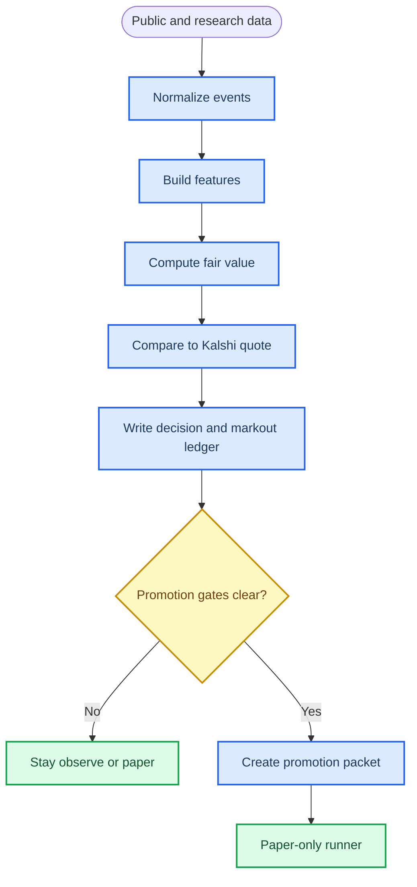

# Kalshi Top 3 Implementation Plan

_Implementation blueprint for the first three strategy/model builds to pursue from the latency playbook, transcript strategy map, and attached paper/log triage. Date: 2026-06-02. Updated: 2026-06-03._

---

## Selection verdict

This plan chooses exactly three initial implementations:

| Rank | Build | Why this is selected first | Latency class | Trading status |
| ---: | --- | --- | --- | --- |
| 1 | Weather KXHIGH distribution and high-so-far ladder | Most mature repo path, strongest existing calibration/testing, slow enough that model quality matters more than VPS latency | Standard to relaxed | Paper only until CLV and settled PnL gates clear |
| 2 | BTC15M timing, c-lead, vol, and trapped-flow observer | Highest optionality and directly answers the VPS question; execution is forbidden until lead and markout are proven | Fast to critical | Observe-only; no orders |
| 3 | Tennis sharp-reference and lifecycle model | Existing odds-enriched model, parity path, and strong need for lifecycle/status hardening before any sports expansion | Relaxed to medium | Paper only; no live-submit |

These are deliberately diverse. Weather is the durable slow sleeve. BTC is the latency/measurement sleeve. Tennis is the sports/model sleeve. Together they test the three most important edge types from the transcript notes: distribution mispricing, execution timing, and stale or overreactive market repricing.

Not selected for the first tranche:

| Candidate | Reason to defer |
| --- | --- |
| Macro CPI/Fed release sniping | Good long-term family, but requires better release-source data and timestamp discipline before implementation. |
| Equity/Nasdaq/Brent anchored CDF | Promising, but less implemented than weather/BTC/tennis. Fold shared `event_vol_mispricing_lab` into future work after BTC/weather schemas exist. |
| Baseball/cricket sports bots | Game-state models and market depth are not proven; defer until `sports_market_discovery` and tennis lifecycle infrastructure are stable. |
| Mention/tweet/news markets | High settlement ambiguity and false-positive risk; build later as observe-only once source timestamp ledgers exist. |
| AVWAP standalone strategy | Useful as a feature, especially in BTC/equity/Brent, but not a first model by itself. |
| Zero-DTE options | Outside Kalshi, high-risk, and not suitable for this repo's no-trading boundary. |

Selection evidence from the repo:

- Weather has `weather/kxhigh.py`, `weather/temperature.py`, `weather/calibration.py`, live-paper scripts, calibration config, and focused tests.
- BTC has a tested settlement kernel, bench script, gap recorder, c-lead recorder, HAR/Student-t terminal-pricing utilities, calibration/cost gates, and a microstructure feasibility analyzer. The missing decisive evidence is still the live official/proxy lead and markout ledger, not more execution code.
- Tennis has the v2 odds-enriched model, ONNX/parity design, odds feed tests, strategy tests, confidence gates, and existing paper/live-paper sleeves.
- Read-only public Kalshi probing on 2026-06-02 found BTC15M, equity index, Nasdaq, Brent, and Core CPI series discoverable. Top-of-book fields were not reliable from that endpoint snapshot, so market depth must still be measured by book/quote capture rather than assumed.

## Attached idea triage

The attached PDFs and pasted work logs are useful as modeling discipline, not as proof of a Kalshi edge. No performance number in them should be copied into a promotion packet unless it is reproduced point-in-time on Kalshi-observed prices.

| Source | Adopt | Defer or reject |
| --- | --- | --- |
| `2605.30562v1.pdf`, stochastic volatility and jumps | Treat stochastic/realized volatility as the first-class driver of BTC terminal and ladder distributions. Keep Student-t or jump overlays as stress/tail features, especially for OTM strikes and liquidity-stress regimes. | Do not build a full PIDE options stack for the first Kalshi pass. Kalshi binaries need coherent CDFs, calibration, and markout before numerical option-pricing machinery. |
| `2605.30943v1.pdf`, inspectable neural Markov models | Use realized-volatility state, not raw return state, as the first regime variable. Add transition/regime diagnostics only if they improve point-in-time calibration or no-trade gating. | Do not introduce a neural transition-matrix model until simple HAR/HMM/regime baselines fail on out-of-sample ledger data. |
| `2605.27848v1.pdf`, HMM plus RL allocation | Borrow the idea of interpretable low/transitional/high-vol regimes and one-step execution lag in evaluation. Keep costs, spread, liquidity, and turnover penalties explicit. | Do not let RL emit candidates. RL can be a research benchmark later, but not a strategy path until the ledger already proves a simpler policy. |
| Pasted work logs | Verify local claims against this checkout. The shared distribution, calibration, BTC lead, weather distribution, tennis state, and microstructure modules are present here. | Treat prior-agent summaries as hints only; tests and live ledgers are the source of truth. |

Hard boundary for every section:

> No live orders. No live-submit. No strategy below is promoted beyond paper or observe-only until the promotion packets prove post-cost edge with timestamped data.

## Shared architecture

The first implementation pass should not create three unrelated scripts. Build one small shared measurement layer and let each strategy write into it.



### Shared modules to use first

These are the shared modules that should anchor the strategy-specific work. In this checkout, most of them already exist; keep future changes small and test them directly.

| File | Purpose |
| --- | --- |
| `python/src/eventcontracts/research/timing.py` | Common timestamp, freshness, and markout data structures. |
| `python/src/eventcontracts/research/ledger.py` | JSONL append/read helpers with schema version, run id, and data hash support. |
| `python/src/eventcontracts/research/artifact_guard.py` | Detect stale reports, changed configs, inconsistent returns, and missing hashes. |
| `python/src/eventcontracts/research/distributions.py` | Shared Normal, Logistic, Student-t, and discrete distributions for ladder CDF pricing. |
| `python/src/eventcontracts/research/calibration.py` | Platt/isotonic calibration, Brier/log-loss reporting, and cost-aware `net_edge` gate. |
| `python/src/eventcontracts/research/microstructure.py` | Read-only quote lifetime, depth, staleness, reaction-lag, and cancel-vs-trade diagnostics. |
| `python/tests/test_research_timing.py` | Unit tests for age calculations, monotonic timestamps, and stale-source flags. |
| `python/tests/test_research_artifact_guard.py` | Unit tests for stale artifact and hash mismatch detection. |

### Shared data structures

Implement these as frozen dataclasses. Keep them small, serializable, and explicit.

```python
@dataclass(frozen=True)
class SourceStamp:
    source: str
    source_ts: datetime | None
    received_at: datetime
    sequence: str | None = None
    raw_age_ms: float | None = None
    stale: bool = False
    stale_reason: str | None = None


@dataclass(frozen=True)
class MarketQuoteSnapshot:
    venue: str
    market_id: str
    ticker: str
    received_at: datetime
    yes_bid: Decimal | None
    yes_ask: Decimal | None
    no_bid: Decimal | None = None
    no_ask: Decimal | None = None
    bid_size: Decimal | None = None
    ask_size: Decimal | None = None
    quote_age_ms: float | None = None
    lifecycle_status: str | None = None


@dataclass(frozen=True)
class ModelValuation:
    model_id: str
    schema_version: str
    market_id: str
    as_of: datetime
    fair_yes: Decimal
    fair_no: Decimal
    confidence: Decimal | None
    feature_hash: str
    feature_payload: Mapping[str, object]
    no_trade_reason: str | None = None


@dataclass(frozen=True)
class EdgeEvaluation:
    market_id: str
    as_of: datetime
    side: str
    fair_price: Decimal
    executable_price: Decimal | None
    raw_edge: Decimal | None
    fee: Decimal | None
    spread_cost: Decimal | None
    net_edge: Decimal | None
    candidate: bool
    reason: str


@dataclass(frozen=True)
class MarkoutPoint:
    market_id: str
    decision_id: str
    offset_ms: int
    observed_at: datetime
    yes_bid: Decimal | None
    yes_ask: Decimal | None
    yes_mid: Decimal | None
    settlement_payout: Decimal | None = None
```

Implementation notes:

- Use timezone-aware `datetime` only.
- Use `Decimal` for market probabilities/prices at the strategy boundary.
- Use floats only for model internals or physical values like temperature and spot.
- Every JSONL row must include `run_id`, `schema_version`, `strategy_family`, `model_id`, `host_id`, and `created_at`.
- Every candidate row must include skipped/no-trade reasons, not just trade candidates.
- The ledger helpers should support `--no-network` fixtures for all strategy scripts.

### Shared test commands

Run these after the shared layer is added:

```powershell
.venv\Scripts\python.exe -m pytest python\tests\test_research_timing.py python\tests\test_research_artifact_guard.py -q
.venv\Scripts\python.exe -m ruff check python\src\eventcontracts\research python\tests\test_research_timing.py python\tests\test_research_artifact_guard.py
```

Expected acceptance:

- timestamp age is computed correctly for source and quote events,
- stale flags trigger when source age exceeds configured max,
- ledger JSON round-trips without losing decimals/timestamps,
- artifact guard fails stale reports when input/config hash changes,
- no helper imports Kalshi credentials or order APIs.

## Model 1: Weather KXHIGH distribution and high-so-far ladder

### Objective

Replace single-point KXHIGH pricing with a coherent station-day distribution:

```text
final_high_f = max(high_so_far_f, remaining_day_high_distribution)
```

Then price every KXHIGH bracket from the same distribution and write a CLV/settlement ledger. This is the best first implementation because the repo already has the core station registry, calibration primitives, and tests.

### Current assets

| Asset | Current use |
| --- | --- |
| `python/src/eventcontracts/weather/kxhigh.py` | Parses KXHIGH markets and prices brackets from `StationCalibration`. |
| `python/src/eventcontracts/weather/temperature.py` | Defines weather snapshots and threshold predictions. |
| `python/src/eventcontracts/weather/calibration.py` | Fits and loads station/month calibration. |
| `python/scripts/weather_kxhigh_paper.py` | Read-only live KXHIGH pricing and ledger script. |
| `configs/weather/station_calibrations.json` | Persisted calibration for NY, CHI, MIA. |
| `python/tests/test_weather_kxhigh.py` | Parsing, probabilities, partition, paper CLV, settlement PnL tests. |

### Files to change or add

| Step | File | Change |
| ---: | --- | --- |
| W1 | `python/src/eventcontracts/weather/temperature.py` | Add ensemble and observation snapshot dataclasses. |
| W2 | `python/src/eventcontracts/weather/kxhigh.py` | Add `DailyHighDistribution` and full-ladder pricing helpers. |
| W3 | `python/scripts/weather_kxhigh_paper.py` | Add optional high-so-far and distribution ledger fields; preserve existing behavior. |
| W4 | `python/scripts/weather_kxhigh_distribution.py` | New no-network capable CLI for fixture/live distribution pricing. |
| W5 | `python/tests/test_weather_distribution.py` | New tests for high-so-far clamping, ensemble probabilities, partition, stale observations. |

### Weather data structures

Add these to `weather/temperature.py` or a new `weather/distribution.py` if the file becomes too crowded:

```python
@dataclass(frozen=True)
class StationObservationSnapshot:
    location: WeatherLocation
    as_of: datetime
    source: str
    high_so_far_f: float | None
    observation_count: int
    latest_observation_ts: datetime | None
    source_age_seconds: float | None
    schema_version: str = "weather-station-observation-v1"


@dataclass(frozen=True)
class EnsembleMemberHigh:
    member_id: str
    daily_high_f: float
    remaining_high_f: float | None = None
    weight: float = 1.0


@dataclass(frozen=True)
class DailyHighDistribution:
    location: WeatherLocation
    target_day: date
    as_of: datetime
    source: str
    values_f: tuple[float, ...]
    weights: tuple[float, ...]
    high_so_far_f: float | None
    mean_f: float
    sigma_f: float
    method: str
    schema_version: str = "weather-daily-high-distribution-v1"
```

Validation rules:

- `values_f` and `weights` must be same length.
- weights must be finite and positive.
- `sigma_f` must respect station calibration floor.
- if `high_so_far_f` exists, no simulated final value may be lower than it.
- `as_of`, `latest_observation_ts`, and forecast timestamps must be timezone-aware.

### Weather modeling plan

Implement three distribution modes, in this order:

1. `normal_calibrated`: existing forecast high plus station calibration sigma.
2. `empirical_ensemble`: ensemble member final highs, calibrated by station/month bias.
3. `hybrid_market_shrunk`: optional later blend of calibrated model and market-implied distribution, used only for sizing/no-trade, not proof of edge.

Core functions:

```python
def build_daily_high_distribution(
    *,
    snapshot: TemperatureForecastSnapshot,
    target_day: date,
    calibration: StationCalibration,
    observation: StationObservationSnapshot | None = None,
    ensemble_members: Sequence[EnsembleMemberHigh] | None = None,
) -> DailyHighDistribution:
    ...


def probability_between(
    distribution: DailyHighDistribution,
    floor_f: float,
    cap_f: float,
) -> float:
    ...


def probability_at_least(
    distribution: DailyHighDistribution,
    threshold_f: float,
) -> float:
    ...


def price_kxhigh_ladder(
    markets: Sequence[dict[str, object]],
    distribution: DailyHighDistribution,
    calibration: StationCalibration,
) -> list[KxhighBracketValuation]:
    ...
```

High-so-far logic:

```text
if high_so_far_f is known:
    final_member = max(high_so_far_f, remaining_member_high_f or member_daily_high_f)
else:
    final_member = member_daily_high_f
```

Normal approximation with high-so-far:

```text
raw = Normal(mean=calibrated_forecast_high, sigma=station_sigma)
final = max(high_so_far_f, raw)
```

For normal mode, compute probabilities analytically:

- for `less cap=C`, if `high_so_far_f >= C`, probability is zero,
- for `between [F, C]`, if `high_so_far_f > C`, probability is zero,
- for `greater floor=F`, if `high_so_far_f >= F + 1`, probability is one,
- otherwise use the calibrated normal CDF with the existing continuity correction.

### Weather ledger row

Every row written by `weather_kxhigh_distribution.py` should include:

```json
{
  "schema_version": "weather-kxhigh-ledger-v2",
  "run_id": "...",
  "strategy_family": "weather_kxhigh_distribution",
  "ticker": "KXHIGHNY-...",
  "series_ticker": "KXHIGHNY",
  "station_code": "NY",
  "target_day": "2026-06-02",
  "as_of": "...",
  "forecast_source": "open-meteo",
  "observation_source": "nws_or_noaa",
  "forecast_age_sec": 12.3,
  "observation_age_sec": 50.0,
  "high_so_far_f": 77.0,
  "distribution_method": "normal_calibrated",
  "distribution_mean_f": 81.2,
  "distribution_sigma_f": 1.9,
  "model_yes": 0.74,
  "yes_bid": 0.61,
  "yes_ask": 0.66,
  "yes_mid": 0.625,
  "spread": 0.05,
  "fee": 0.016,
  "net_edge_yes": 0.074,
  "candidate": true,
  "no_trade_reason": null
}
```

### Weather code-along

1. Add the dataclasses and pure probability helpers.
2. Write `test_high_so_far_kills_impossible_less_bucket`.
3. Write `test_high_so_far_forces_greater_bucket_to_one`.
4. Write `test_empirical_ensemble_partition_sums_to_one`.
5. Write `test_normal_distribution_matches_existing_calibration_when_no_observation`.
6. Extend `weather_kxhigh_paper.py` only after pure tests pass.
7. Add `weather_kxhigh_distribution.py --no-network --fixture path`.
8. Add a fixture with three markets and a forecast/observation snapshot.
9. Verify JSONL rows contain all required schema fields.
10. Run the existing weather tests.

Commands:

```powershell
.venv\Scripts\python.exe -m pytest python\tests\test_weather_distribution.py python\tests\test_weather_kxhigh.py python\tests\test_weather_calibration.py -q
.venv\Scripts\python.exe python\scripts\weather_kxhigh_distribution.py --no-network --fixture python\tests\fixtures\weather\kxhigh_distribution.json --ledger data\research\weather_kxhigh_distribution_selftest.jsonl
.venv\Scripts\python.exe -m ruff check python\src\eventcontracts\weather python\scripts\weather_kxhigh_distribution.py python\tests\test_weather_distribution.py
```

### Weather promotion gates

Do not promote beyond paper until all are true:

- at least 100 paper candidates across multiple cities/days,
- positive CLV after fee and half-spread stress,
- settled fee-net PnL positive by station bucket,
- no single station or heat regime explains all PnL,
- no stale observation candidate is counted as actionable,
- high-so-far and final settlement source are reconciled to the same station/rules.

Capital and latency:

| Phase | Capital | Latency needed | Notes |
| --- | ---: | --- | --- |
| Research | $0 | seconds to minutes | Offline and read-only live paper. |
| Paper | $0 | seconds | Current host is fine. |
| Tiny live outside this workspace | $500-$2,000 | seconds | Only after promotion packet and explicit user approval elsewhere. |
| Pilot | $5,000-$25,000 | seconds | Limited by bracket liquidity and city correlation. |

## Model 2: BTC15M timing, c-lead, vol, and trapped-flow observer

### Objective

Build the decisive BTC observer before any execution logic:

```text
source lead - residual submit RTT - quote/book staleness > 0
```

The output is not a trade. It is a timestamped ledger that proves whether synthetic BTC constituent data leads Kalshi/official settlement-relevant prints enough to matter.

### Current assets

| Asset | Current use |
| --- | --- |
| `python/src/eventcontracts/research/btc_settlement.py` | Tested settlement kernel and implied sigma helpers. |
| `python/src/eventcontracts/research/btc_lead.py` | Pure synthetic-index, lead, volatility, and timing-candidate helpers. |
| `python/src/eventcontracts/research/har_rv.py` | HAR, HAR-RS, and HAR-CJ realized-volatility forecasts for terminal/vol features. |
| `python/src/eventcontracts/research/btc_terminal.py` | Student-t BTC terminal distribution for daily/fixed-time strike ladders. |
| `python/src/eventcontracts/research/microstructure.py` | Quote-lifetime, depth, staleness, reaction-lag, and trade/cancel decomposition. |
| `python/scripts/btc_settlement_bench.py` | Compute/network benchmark. |
| `python/scripts/btc_settlement_gap.py` | Model-vs-market gap recorder with stale spot safeguards. |
| `python/scripts/btc_clead_recorder.py` | Public Coinbase/Kraken WS synthetic-index recorder with `--no-network` self-test. |
| `python/scripts/microstructure_prescreen.py` | Read-only REST pre-screen for BTC/Kalshi quote lifetime and reaction lag. |
| `python/tests/test_btc_settlement.py` | Kernel math tests. |
| `python/tests/test_btc_lead.py` | Parser, stale-component, lead, and timing-candidate tests. |
| `python/tests/test_quant_models.py` | Distribution, HAR-family, and BTC terminal-pricer tests. |
| `python/tests/test_microstructure.py` | Microstructure analyzer tests. |
| `live-test/ec2-findings.md` | Existing EC2/local read-latency results. |

### Files to change or add

| Step | File | Change |
| ---: | --- | --- |
| B1 | `python/src/eventcontracts/research/btc_lead.py` | Pure state machines for crypto ticks, synthetic index, AVWAP anchors, timing rows. |
| B2 | `python/scripts/btc_clead_recorder.py` | Public WS recorder for Coinbase and Kraken with `--no-network` self-test. |
| B3 | `python/tests/test_btc_lead.py` | Unit tests for tick parsing, weighted synthetic index, stale handling, AVWAP. |
| B4 | `python/tests/test_btc_clead_recorder.py` | CLI no-network test and ledger schema validation. |
| B5 | `live-test/ec2-findings.md` | Append measured recorder results after EC2 run. |

### BTC data structures

```python
@dataclass(frozen=True)
class CryptoTick:
    venue: str
    symbol: str
    price: float
    size: float | None
    side: str | None
    exchange_ts: datetime | None
    received_at: datetime
    sequence: str | None = None


@dataclass(frozen=True)
class SyntheticIndexComponent:
    venue: str
    symbol: str
    price: float
    weight: float
    exchange_ts: datetime | None
    received_at: datetime
    age_ms: float | None


@dataclass(frozen=True)
class SyntheticIndexSnapshot:
    as_of: datetime
    index_id: str
    c_synth: float
    components: tuple[SyntheticIndexComponent, ...]
    max_component_age_ms: float | None
    component_spread_bps: float | None
    stale: bool
    stale_reason: str | None


@dataclass(frozen=True)
class AvwapAnchor:
    anchor_id: str
    anchor_kind: str
    anchor_ts: datetime
    anchor_price: float
    cumulative_pv: float
    cumulative_volume: float
    last_price: float


@dataclass(frozen=True)
class BtcTimingLedgerRow:
    schema_version: str
    run_id: str
    ts: datetime
    contract_ticker: str | None
    c_synth: float
    c_synth_age_ms: float | None
    kalshi_yes_bid: Decimal | None
    kalshi_yes_ask: Decimal | None
    quote_age_ms: float | None
    seconds_to_expiry: float | None
    model_yes: float | None
    market_mid: float | None
    implied_sigma_per_sec: float | None
    realized_sigma_per_sec: float | None
    source_lead_ms: float | None
    lead_label: str
    candidate_gap: float | None
    candidate: bool
    no_trade_reason: str
    features: Mapping[str, object]
```

### BTC modeling plan

Build this in nested layers:

1. Source layer: Coinbase and Kraken public WS ticks/trades.
2. Synthetic index layer: compute `c_synth` from current component prices.
3. Volatility layer: compute rolling realized sigma and, for longer fixed-time BTC ladders, HAR/HAR-RS/HAR-CJ forecasts.
4. Regime layer: use realized-volatility state as the first state variable; only add HMM/neural Markov diagnostics if they improve out-of-sample calibration or no-trade gates.
5. Settlement valuation layer: feed `c_synth`, strike, sigma, and seconds-to-expiry into `forecast_at` for BTC15M. For daily/fixed-time BTC ladders, use `BtcTerminalModel` with a Student-t/normal comparison.
6. Calibration and cost layer: evaluate raw gaps only after Platt/isotonic calibration, Kalshi fee, spread, slippage, stale-source, and basis gates.
7. Microstructure layer: measure quote lifetime, depth, feed staleness, reaction lag, and cancel-vs-trade mix before calling any latency window catchable.
8. Timing/markout layer: compare source timestamps to official/proxy settlement-relevant prints and Kalshi quote timestamps, then write later markouts.

Paper/log implications for BTC:

- Stochastic or realized volatility should be the backbone. Jumps/fat tails are overlays for stress and OTM tails, not a reason to skip calibration.
- Raw returns are a weak state variable; volatility state is the first regime axis to try.
- HMM/RL-style policies are research-only until a simpler point-in-time policy has survived costs, liquidity, and markout.
- A positive model-vs-market gap is still a measurement defect until Coinbase-vs-CFB basis, source freshness, quote age, spread, and fees fail to explain it.

Synthetic index rule:

```text
c_synth = weighted_mean(latest_component_prices)
```

Initial weights:

- equal weight for Coinbase and Kraken while only two constituents are captured,
- configurable weights later if official CF Benchmarks constituent weights are known and legally usable,
- no synthetic index row is actionable if fewer than two fresh components are present.

Official RTI handling:

- If official CF Benchmarks RTI print is available read-only, log `lead_label="official_rti"`.
- If not available, log `lead_label="proxy_only_no_official_rti"`.
- Never fabricate official lead. A proxy lead is useful for engineering but not proof of edge.

AVWAP/trapped-flow observe-only features:

| Feature | Definition |
| --- | --- |
| `avwap_contract_open` | Volume-weighted price since the 15m contract opened. |
| `avwap_window_open` | Volume-weighted price since the final 60s window opened. |
| `dist_to_avwap_bps` | Current `c_synth` minus anchor AVWAP. |
| `component_spread_bps` | Max/min component price dispersion. |
| `realized_sigma_60s` | Per-second realized sigma over recent ticks. |
| `har_rv_forecast` | Longer-horizon realized-volatility forecast for fixed-time BTC ladders. |
| `vol_state` | Low/transitional/high realized-volatility regime label, point-in-time only. |
| `threshold_distance_usd` | `c_synth - strike`. |
| `quote_lifetime_ms` | How long the executable top of book rested before changing. |
| `reaction_lag_s` | Lag maximizing correlation between reference returns and Kalshi mid returns. |
| `repricing_trade_fraction` | Share of top-of-book moves coincident with trades rather than bare cancels. |
| `liquidation_pressure` | Placeholder until a lawful/read-only liquidation source is integrated. |

### BTC code-along

1. Verify existing `CryptoTick` and pure parsers for Coinbase/Kraken fixture messages.
2. Verify existing `SyntheticIndexState.update(tick) -> SyntheticIndexSnapshot`.
3. Verify stale component logic: reject if any required component age exceeds `max_component_age_ms`.
4. Verify existing `RollingRealizedVol` with fixed time window.
5. Add or verify `AvwapState` with deterministic anchors.
6. Keep `btc_clead_recorder.py --no-network` green and use it before every live recorder change.
7. Keep public WS clients read-only and unauthenticated.
8. Add optional Kalshi public REST/WS market quote sampling, read-only.
9. Join `SyntheticIndexSnapshot`, volatility state, microstructure snapshot, and Kalshi quote into `BtcTimingLedgerRow`.
10. Add markout writer for `+1s`, `+5s`, `+30s`, and settlement when available.
11. Add an official RTI adapter only if a read-only legal source is available; otherwise keep `lead_label="proxy_only_no_official_rti"`.
12. Produce an EC2 measurement packet before any further latency/execution design.

Commands:

```powershell
.venv\Scripts\python.exe -m pytest python\tests\test_btc_settlement.py python\tests\test_btc_lead.py python\tests\test_btc_clead_recorder.py -q
.venv\Scripts\python.exe python\scripts\btc_clead_recorder.py --no-network --duration-sec 2 --ledger live-test\btc_clead_selftest.jsonl
.venv\Scripts\python.exe -m ruff check python\src\eventcontracts\research\btc_lead.py python\scripts\btc_clead_recorder.py python\tests\test_btc_lead.py
```

EC2 measurement commands after self-test:

```bash
cd ~/eventcontracts
source .venv/bin/activate
python python/scripts/btc_clead_recorder.py --series KXBTC15M --duration-sec 900 --ledger live-test/btc_clead_ec2.jsonl
python python/scripts/btc_settlement_gap.py --series KXBTC15M --ledger live-test/btc15m_gap_ledger.jsonl
```

### BTC promotion gates

Execution remains forbidden until all are true:

- c-synth source lead over official RTI or accepted proxy is reliably positive,
- source lead is greater than residual submit/read RTT budget,
- top-of-book lifetime is longer than detect plus residual submit budget for the relevant side,
- a meaningful share of repricing is trade-driven rather than bare-cancel driven,
- candidate gaps clear fee, spread, stale-input, and adverse-selection stress,
- raw and calibrated probabilities improve Brier/log-loss out of sample,
- Student-t/HAR or regime features improve out-of-sample markout rather than only in-sample fit,
- markout is positive out of sample across many 15m windows,
- no Coinbase-versus-index basis bug explains the signal,
- the ledger records skipped rows and stale rejects, not only candidates.

Capital and latency:

| Phase | Capital | Latency needed | Notes |
| --- | ---: | --- | --- |
| Research observer | $0 | low jitter helps | Public data only. |
| EC2 observer | $0 plus compute | 5-20 ms useful | Already materially better than local read RTT. |
| Trial low-latency VPS | $50-$500 | sub-2 ms only if lead exists | Keep only if ledger improves markout or lead budget. |
| Execution | Not authorized | sub-2 to sub-20 ms | Requires separate explicit approval and promotion packet. |

## Model 3: Tennis sharp-reference and lifecycle model

### Objective

Turn the existing tennis sleeve into a safer, sharper research/paper strategy:

```text
fair = sharp_reference_fair + model_residual
```

Then block every stale, finished, unmapped, low-liquidity, or odds-missing market before it can emit a candidate.

This is selected over baseball/cricket because the repo already has a tennis model, odds data, tests, configs, and strategy parity work.

### Current assets

| Asset | Current use |
| --- | --- |
| `python/src/eventcontracts/research/tennis_v2.py` | v2 feature engineering with odds block and schema version. |
| `python/src/eventcontracts/research/tennis_odds_feed.py` | Odds feed merge helpers. |
| `python/scripts/tennis_clv_realprice.py` | Real vigged entry CLV study. |
| `python/src/eventcontracts/plugins/strategies/sports_tennis_xgboost.py` | Strategy with confidence/odds gates and trailing stop. |
| `configs/strategies/sports-tennis-xgboost.toml` | Paper config, `require_odds_present=true`, confidence gate. |
| `python/tests/test_tennis_v2_research.py` | Feature schema, odds merge, no self-leakage, parity fixture tests. |
| `python/tests/test_sports_tennis_xgboost_strategy.py` | Strategy behavior, odds gate, confidence gate, trailing stop tests. |

### Files to change or add

| Step | File | Change |
| ---: | --- | --- |
| T1 | `python/src/eventcontracts/research/tennis_market_state.py` | New canonical lifecycle, mapping, and market candidate dataclasses. |
| T2 | `python/scripts/sports_market_discovery.py` | Read-only scanner for tennis markets, schedule links, liquidity, lifecycle. |
| T3 | `python/scripts/tennis_sharp_reference_signal.py` | Generate fair-value `ExternalSignalEvent` JSONL from sharp odds and model residual. |
| T4 | `python/scripts/paper_passive_bid_simulator.py` | Generic paper-only passive-entry simulator for tennis first. |
| T5 | `python/tests/test_tennis_market_state.py` | Lifecycle/mapping/stale-market tests. |
| T6 | `python/tests/test_paper_passive_bid_simulator.py` | Duplicate order, side flip, stale quote, and no-fill simulation tests. |

### Tennis data structures

```python
@dataclass(frozen=True)
class TennisMarketCandidate:
    market_id: str
    ticker: str
    event_title: str
    player_1: str
    player_2: str
    start_time: datetime | None
    market_status: str
    match_status: str | None
    liquidity: Decimal | None
    yes_bid: Decimal | None
    yes_ask: Decimal | None
    quote_received_at: datetime | None
    mapped_match_id: str | None
    mapping_confidence: Decimal


@dataclass(frozen=True)
class SharpOddsSnapshot:
    match_id: str
    source: str
    as_of: datetime
    player_1_decimal: Decimal
    player_2_decimal: Decimal
    player_1_fair: Decimal
    player_2_fair: Decimal
    overround: Decimal
    source_age_seconds: float | None


@dataclass(frozen=True)
class TennisLifecycleState:
    match_id: str
    status: str
    set_score: str | None
    game_score: str | None
    point_score: str | None
    server: str | None
    source: str
    source_ts: datetime | None
    received_at: datetime
    stale: bool


@dataclass(frozen=True)
class TennisFairValue:
    match_id: str
    market_id: str
    as_of: datetime
    player_1_fair: Decimal
    player_2_fair: Decimal
    model_residual: Decimal
    model_confidence: Decimal
    odds_present: bool
    no_trade_reason: str | None
```

### Tennis modeling plan

Initial fair value:

```text
sharp_fair = de_vig(sharp_book_odds)
model_residual = clamp(xgboost_model_prob - historical_market_baseline, -r, +r)
final_fair = shrink(sharp_fair + model_residual, sharp_fair, residual_weight)
```

Recommended first pass:

- set `residual_weight = 0` for the pure sharp-reference baseline,
- only enable residual if it improves CLV out of sample,
- keep `require_odds_present=true`,
- retain `min_model_confidence >= 0.62` if using the v2 model,
- separate pre-match and in-play ledgers.

Lifecycle hard guards:

| Guard | Rule |
| --- | --- |
| Market open | Kalshi market must be open/active. |
| Match not finished | external status must not be completed, retired, walkover, cancelled, or unknown-stale. |
| Source fresh | odds and status must be within configured max age. |
| Mapping confidence | player names must map above threshold and both players must be present. |
| Odds present | both sides decimal odds must be valid and > 1.0. |
| No duplicate intent | simulator/strategy cannot have position plus same-side open order unless explicitly configured. |
| Side flip | stale side orders are cancelled before new side intent. |

### Tennis code-along

1. Implement `tennis_market_state.py` dataclasses and `normalize_player_name`.
2. Write tests for name mapping, start-time parsing, and lifecycle status.
3. Build `sports_market_discovery.py --sport tennis --no-network --fixture ...`.
4. Emit `TennisMarketCandidate` rows with `no_trade_reason` when unmapped or stale.
5. Build `tennis_sharp_reference_signal.py` to read odds snapshots and emit `ExternalSignalEvent`.
6. Keep the event payload compatible with `SportsTennisXgboostStrategy`: `market_id`, `player_1_win_probability`, `model_confidence`, `odds_present`.
7. Add lifecycle metadata to the payload: `match_status`, `status_source_age_sec`, `mapping_confidence`, `format`, `tour`.
8. Extend `SportsTennisXgboostStrategy` only if needed to reject lifecycle metadata; otherwise keep lifecycle rejection upstream in signal generation.
9. Build `paper_passive_bid_simulator.py` with conservative fill assumptions.
10. Add duplicate-order, position-plus-order, and side-flip tests.

Commands:

```powershell
.venv\Scripts\python.exe -m pytest python\tests\test_tennis_market_state.py python\tests\test_tennis_odds_feed.py python\tests\test_tennis_v2_research.py python\tests\test_sports_tennis_xgboost_strategy.py -q
.venv\Scripts\python.exe python\scripts\sports_market_discovery.py --sport tennis --no-network --fixture python\tests\fixtures\tennis\markets.json --ledger data\research\tennis_market_discovery_selftest.jsonl
.venv\Scripts\python.exe python\scripts\tennis_sharp_reference_signal.py --no-network --fixture python\tests\fixtures\tennis\sharp_reference.json --out data\research\tennis_sharp_signals_selftest.jsonl
.venv\Scripts\python.exe -m ruff check python\src\eventcontracts\research\tennis_market_state.py python\scripts\sports_market_discovery.py python\scripts\tennis_sharp_reference_signal.py
```

### Tennis promotion gates

Do not promote beyond paper until all are true:

- positive CLV at actual Kalshi-observed prices,
- performance separated by odds source, tournament level, surface, tour, format, and liquidity bucket,
- lifecycle rejects are logged and nonzero in replay,
- no finished/stale match can emit a candidate,
- paper passive-fill assumptions are conservative and documented,
- Python/Rust parity remains green for any strategy payload shape change.

Capital and latency:

| Phase | Capital | Latency needed | Notes |
| --- | ---: | --- | --- |
| Research | $0 | seconds | Historical odds and quote capture. |
| Paper | $0 | seconds | Current infra enough for pre-match. |
| In-play observe | $0 | source dependent | Data freshness matters more than host latency. |
| Tiny live outside this workspace | $500-$2,000 | 100 ms to seconds | Requires explicit approval and status feed proof. |

## Shared validation and promotion packet

Every selected model must output a promotion packet before any capital is discussed.

### Packet contents

| Section | Required evidence |
| --- | --- |
| Market universe | Exact series/tickers, lifecycle statuses, resolution rules. |
| Data sources | Source URLs/providers, timestamp fields, freshness limits, failure modes. |
| Model | Formula, feature schema, calibration method, no-trade gates. |
| Backtest/replay | Point-in-time split, raw ledger, costs, fill assumptions, markout. |
| Robustness | Walk-forward, regime breakdown, parameter perturbation, cost stress. |
| Risk | Max order, max position, daily loss, correlated-event cap, kill switches. |
| Operations | Run command, logs, alerts, stale-source behavior, stop command. |
| Parity | Python tests, Rust tests/parity when strategy payload crosses runtime boundary. |

### Backtest artifact guard

Before accepting any report:

- input file hashes must match report hashes,
- config hash must match report hash,
- report timestamp must be newer than inputs,
- raw trades must recompute the reported return,
- both compounded and uncompounded returns must be shown,
- Sharpe/Sortino/drawdown must come from the same equity curve,
- train/validation/test splits must be locked,
- all losing variants from a hypothesis run must remain archived.

### Paper-derived validation constraints

- Point-in-time data is mandatory. Revised CPI nowcasts, final consensus files, final volatility estimates, and hindsight market status all fabricate edge.
- Regime labels must be computed from information available at the decision timestamp, with at least one-step execution lag where appropriate.
- Distribution-shape upgrades must earn their keep out of sample. A Student-t, jump, HMM, or neural Markov layer is a rejected hypothesis unless it improves calibrated markout after costs.
- Any HMM/RL-style result must include spread, fee, slippage, turnover, liquidity, and stale-source penalties before it can influence candidate emission.
- Market-implied/risk-neutral evidence is not physical edge. Use it as a calibration or no-trade feature unless settled-outcome ledgers prove otherwise.

### Minimal quality gate

Use targeted tests during implementation. Before a promotion claim, run:

```powershell
.venv\Scripts\python.exe -m ruff check python\src python\scripts python\tests
.venv\Scripts\python.exe -m pytest python\tests -q
cargo test --manifest-path rust\Cargo.toml --workspace
```

Known hygiene warning from the current playbook: broad Python mypy and some Rust formatting/clippy gates had existing failures in the prior audit. Do not hide those. If they are still present, report them as existing blockers and keep targeted tests clean for touched files.

## Implementation order

### Week 1: Shared measurement layer and weather distribution

1. Verify `timing.py`, `ledger.py`, `artifact_guard.py`, `distributions.py`, and `calibration.py`.
2. Verify weather distribution dataclasses and high-so-far logic.
3. Verify `weather_kxhigh_distribution.py --no-network`.
4. Run weather targeted tests.
5. Start paper ledger capture when live markets are available.

### Week 2: BTC observer

1. Verify `btc_lead.py`, `btc_clead_recorder.py --no-network`, and public WS clients.
2. Verify HAR/Student-t terminal helpers and calibration tests.
3. Verify `microstructure.py` and `microstructure_prescreen.py` on fixtures.
4. Run local observer for short windows.
5. Run EC2 observer and append findings.
6. Produce a go/no-go measurement packet for c-lead plus quote lifetime before any execution design.

### Week 3: Tennis market-state and sharp reference

1. Add `tennis_market_state.py`.
2. Add `sports_market_discovery.py` for tennis.
3. Add `tennis_sharp_reference_signal.py`.
4. Add paper passive-bid simulator.
5. Run quote/fair-value capture and CLV reports.

### Week 4: Promotion packet assembly

1. Generate weather promotion packet if enough paper candidates exist.
2. Generate BTC measurement packet, likely observe-only unless lead is decisively positive.
3. Generate tennis CLV/lifecycle packet.
4. Decide whether to continue, kill, or widen each model.

## Kill switches

These should halt candidate emission immediately:

| Family | Kill switch |
| --- | --- |
| Weather | observation stale, station mismatch, high-so-far impossible relative to settlement source, bracket parsing failure, forecast older than configured max |
| BTC | fewer than two fresh components, component spread above threshold, no official/proxy lead label, Kalshi quote stale, spot/index basis unmeasured for actionable claim |
| Tennis | match finished, market closed, odds missing when required, mapping confidence low, status source stale, duplicate order/position invariant failure |
| Shared | ledger write failure, config hash mismatch, risk cap missing, unknown schema version |

## Developer checklist

Use this as the implementation checklist:

- [ ] Add shared timing and ledger dataclasses.
- [ ] Add artifact guard and tests.
- [ ] Add weather distribution and high-so-far tests.
- [ ] Add weather distribution CLI self-test.
- [ ] Add BTC lead state and recorder self-test.
- [ ] Add Coinbase/Kraken public WS clients after fixtures pass.
- [ ] Add tennis market-state dataclasses and lifecycle tests.
- [ ] Add tennis discovery and sharp-signal CLIs.
- [ ] Add passive simulator lifecycle invariant tests.
- [ ] Run targeted pytest and ruff for touched files.
- [ ] Produce first paper/observe ledgers.
- [ ] Produce promotion packets or explicit kill reports.

## Final recommendation

Start with weather implementation immediately because it is closest to a durable, testable paper sleeve. Build BTC second because it decides whether latency spend is rational at all. Build tennis third because it turns an already-developed model into a safer, sharper sports sleeve and creates reusable sports infrastructure for later baseball/cricket ideas.

Do not build execution first for any of these. Build ledgers first, then markout, then promotion packets. The edge is not the model's story; the edge is what remains after timestamp, spread, fee, stale-source, and fill assumptions all try to kill it.
